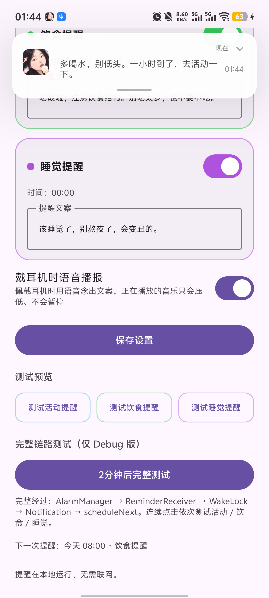
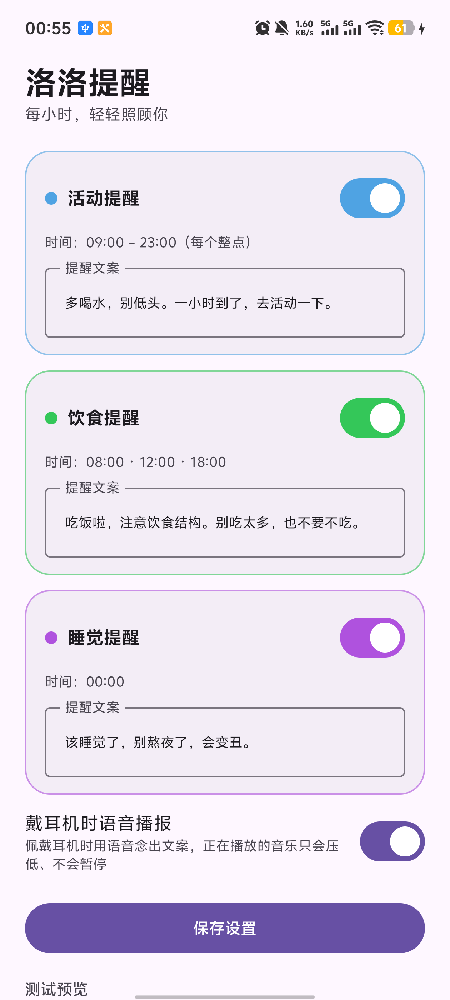
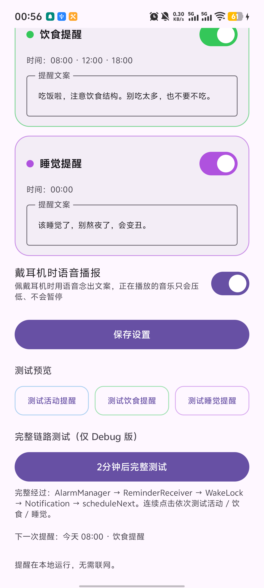
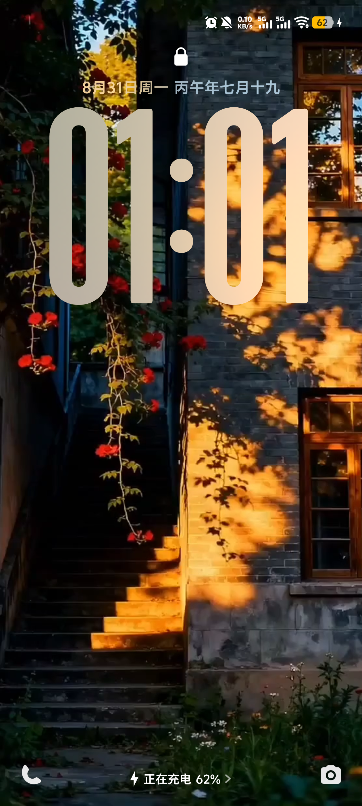

# 洛洛提醒 Luoluo Reminder 🧜‍♀️

<p align="center">
  
</p>

**一句话**：给“该喝水、该起身、该睡觉”的极简 Android 健康提醒。全程本地运行 —— **没有 INTERNET 权限、没有常驻后台、没有第三方 SDK**。

> **English TL;DR**: A minimal Android self-care reminder (drink water / stand up / go to bed). 100% offline: **no INTERNET permission, no foreground service, no polling, no SDK**. Built with Kotlin + Jetpack Compose, tested on Android 8.0–16 including vivo OriginOS 16.

<div align="center">
  
  
  
</div>

## ✨ 功能

| 功能 | 说明 |
| --- | --- |
| 🏃 活动提醒 | 09:00–23:00 每个整点 |
| 🍚 饮食提醒 | 08:00 / 12:00 / 18:00 |
| 🌙 睡觉提醒 | 00:00 |
| 🔀 碰撞合并 | 同一时刻多个提醒命中时只弹一条（饮食 > 活动 > 睡觉），绝不连弹 |
| ✏️ 文案自定义 | 三类提醒的文案都可编辑 |
| 🌙 灭屏亮屏 | 闹钟到达时若屏幕未亮，短暂点亮约 10 秒后自动释放 |
| 🎧 语音播报 | 佩戴耳机时用 TTS 念出文案；瞬时音频焦点 MAY_DUCK，音乐只压低不暂停 |
| 🎨 个性化 | ⚙ 设置页：首页顶部标题（可选，12 字内）、通知头像图、首页背景图（均从相册选，可清除） |
| 🧪 Debug 工具 | Debug 版内置“测试预览”按钮与“2分钟后完整链路测试”，走真实闹钟链路（Release 不含） |

### Release 与 Debug 的区别

同一套代码，只有默认值与测试工具不同：

| | Debug（开源用户默认构建） | Release（正式版） |
| --- | --- | --- |
| 首页顶部标题 | 默认显示“今天也要努力生活呀！加油鸭！” | 默认空白（设置页可自定义） |
| 测试按钮 / 完整链路测试 | 显示 | 隐藏 |

在 `app/build.gradle.kts` 的 `buildTypes` 里通过 `resValue("string", "app_name", …)` 与代码内 `isDebugBuild` 区分。

## 💪 我们的优势（为什么是这个项目）

1. **真的零联网**：Manifest 里**没有 INTERNET 权限**，可以用 `aapt dump badging` 验证。不采集任何数据。
2. **真的零常驻**：没有前台/后台 Service、没有轮询线程、没有长时 WakeLock。整个应用同一时刻只挂**一个** `AlarmManager` 闹钟，触发后“发通知 → 排下一次 → 立即休眠”。
3. **低功耗优先**：使用 `setAndAllowWhileIdle` 非精确闹钟，不申请 `SCHEDULE_EXACT_ALARM`，允许系统分钟级误差，Doze 下也能按系统规则触发。
4. **国产 ROM 深度踩坑实录**：OriginOS/vivo 的白名单、开机广播、通知开关、图标缓存行为全部实测并写进文档（见下文）。
5. **代码极简**：Kotlin + Jetpack Compose 单模块，核心逻辑 ~800 行，无 DI 框架、无多模块、无 Repository 套娃，适合作为闹钟/提醒类 App 的学习参考。
6. **通知可以放你自己的角色图**：一张图 + 一句话，就是一条温柔的健康提醒（见下文“怎么换图片”）。

## 📱 适配范围 / Compatibility

- **Android 8.0 (API 26) → Android 16 (API 36)**（在 vivo V2307A / OriginOS 16.0 真机全链路实测：通知、灭屏亮屏、开机恢复、语音播报）
- Android 13+ 通知权限运行时请求；拒绝后应用内引导，不崩溃
- 不申请：`INTERNET`、`SCHEDULE_EXACT_ALARM` / `USE_EXACT_ALARM`、`SYSTEM_ALERT_WINDOW`、`ACCESSIBILITY`

## 🔧 OriginOS / 国产 ROM 适配笔记（踩坑实录）

以下均为 vivo V2307A（OriginOS 16 / Android 16）真机实测结论：

| 现象 | 结论 / 应对 |
| --- | --- |
| 灭屏时闹钟不触发 | 未加电池白名单的应用，闹钟会被系统扣押。**设置“后台高耗电”后必须重启一次才生效**（实测） |
| BOOT_COMPLETED 不执行 | 系统把它压到**用户首次解锁之后**才投递，属正常系统策略 |
| 悬浮横幅不弹出 | OriginOS 默认关闭第三方应用的“悬浮通知/锁屏通知”，需在 设置→通知→应用 中手动开启 |
| 折叠通知被裁切 | 系统会压缩自定义 RemoteViews 高度，布局需控制在一行标题 + 两行正文以内 |
| 换启动图标不生效 | 图标缓存问题，**重启一次**即刷新 |
| 闹钟迟到 | 非精确闹钟会被批处理推迟（实测最长 ±20 分钟）；应用侧用 30 分钟容忍窗口，超时放弃本次但照常排下一次 |
| 同一事件重复弹 | 系统补发迟到闹钟时可能重复投递；应用内按“类型@时刻”去重 |

## 🖼️ 怎么换成你自己的角色图片

### 1. 通知头像 + 首页背景（应用内直接选，无需重新编译）
打开 App → 底部 ⚙ 进入设置：
- **通知头像图片**：从相册选一张，显示在通知文字左侧（不选则不显示）；
- **首页背景图片**：从相册选一张作为首页背景，自动叠加白色蒙层。

### 2. App 图标（通知头部 + 桌面）
准备一张**方形、透明底**的人物 PNG，替换：

```
app/src/main/res/drawable-nodpi/ic_launcher_fg.png
```

> 注意：自适应图标有 66/108 安全区，人物脸放中间约 55% 区域，四周留透明边，否则会被裁切。
> 换完后**重启手机**一次刷新图标缓存（OriginOS 实测需要）。

### 3. （可选）通知里内嵌人物图的默认素材
把 PNG 放到 `app/src/main/res/drawable-nodpi/luoluo_person.png`（当前构建默认不带内嵌人物，走应用内选图）。

### 4. 从原图裁剪的脚本（Windows PowerShell）
本项目用的角色图裁剪脚本（裁脸 → 缩放到图标尺寸）：

```powershell
Add-Type -AssemblyName System.Drawing
$src = New-Object System.Drawing.Bitmap('persona_source.png')   # 1254x1254 透明底
$dst = New-Object System.Drawing.Bitmap(512,512)
$g = [System.Drawing.Graphics]::FromImage($dst)
$g.InterpolationMode = [System.Drawing.Drawing2D.InterpolationMode]::HighQualityBicubic
# 人物脸放在中间 58%（自适应图标安全区），四周透明留边
$g.DrawImage($src, (New-Object System.Drawing.Rectangle(108,108,296,296)),
                  (New-Object System.Drawing.Rectangle(20,20,600,600)), [System.Drawing.GraphicsUnit]::Pixel)
$dst.Save('ic_launcher_fg.png', [System.Drawing.Imaging.ImageFormat]::Png)
```

本项目的角色原图见 [docs/persona_source.png](docs/persona_source.png)。

## ⚙️ 提醒机制

```
[保存设置] ──► SharedPreferences 持久化
          ──► 只挂一个闹钟：所有已开启类型中最早的下一次事件
              AlarmManager.setAndAllowWhileIdle(RTC_WAKEUP, …)
                                   │
        （App 进程休眠 / 被划掉，系统照常计时）
                                   ▼
                        ReminderReceiver.onReceive
              1. dueEvent()：碰撞窗口内按 饮食>活动>睡觉 取最高优先级
              2. ScreenWake：屏幕未亮则点亮约 10 秒（自动释放）
              3. 发通知（可戴耳机 TTS 播报）
              4. scheduleNext() 安排下一次（按“类型@时刻”去重）
                                   ▲
[开机 / 时间或时区变化] ──► BootReceiver：任一提醒开启时恢复计划
```

时间网格 = 每天 `开始时间 + k × 间隔`，全部整点对齐；夜间（结束之后到次日开始之前）不安排任何提醒。

## 🔐 权限（仅 4 个，均为功能必需）

| 权限 | 用途 |
| --- | --- |
| `POST_NOTIFICATIONS` | Android 13+ 发通知（运行时请求） |
| `RECEIVE_BOOT_COMPLETED` | 开机后恢复提醒计划 |
| `VIBRATE` | 通知震动 |
| `WAKE_LOCK` | 闹钟到达时短暂亮屏（约 10 秒自动释放） |

刻意**不申请**：`INTERNET`、`SCHEDULE_EXACT_ALARM`、`SYSTEM_ALERT_WINDOW`、`ACCESSIBILITY`。

## 🏗️ 构建

要求：JDK 17+、Android SDK Platform 35。

```bash
./gradlew :app:assembleDebug      # Debug（含完整链路测试按钮）
./gradlew :app:assembleRelease    # Release（R8 压缩，debug 签名可直接安装）
./gradlew :app:testDebugUnitTest  # 17 个调度/碰撞单元测试
```

依赖解析默认优先阿里云镜像（`settings.gradle.kts`），Gradle 分发包走腾讯镜像（`gradle/wrapper/gradle-wrapper.properties`），国内网络开箱即用。

## ⚠️ 已知限制（诚实说明）

- Android 12+ 会给自定义通知强制加系统头部（小图标 + 时间），无法隐藏 —— 本项目把应用名置空来弱化它。
- 用户在系统设置里“强行停止”App 会清掉闹钟（Android 系统设计）；重新打开 App 自动恢复。
- 无精确闹钟权限，提醒有分钟级误差；闹钟被系统推迟超过 30 分钟时放弃该次展示（避免过时提醒打扰）。
- 语音播报依赖系统 TTS 引擎，未安装 TTS 的设备自动跳过。

## 🔍 检索词 / Keywords

`喝水提醒` `久坐提醒` `起身提醒` `每小时提醒` `整点提醒` `睡觉提醒` `健康提醒` `提醒工具` `hourly reminder` `water reminder` `stand up reminder` `sedentary reminder` `bedtime reminder` `self-care app` `Android AlarmManager` `setAndAllowWhileIdle` `heads-up notification` `full screen wake` `TTS announce` `audio focus may duck` `Jetpack Compose` `Kotlin` `Material 3` `OriginOS 适配` `vivo 适配` `国产 ROM 适配` `无网络权限` `离线应用` `极简应用` `开源 Android 工具` `open source android app` `no internet permission`

## 📄 License

[MIT](LICENSE)
